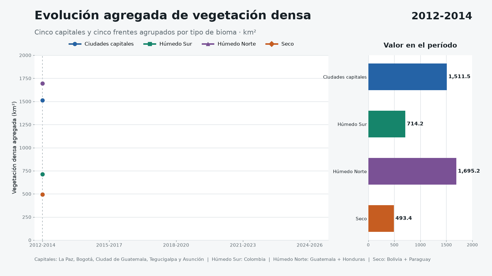
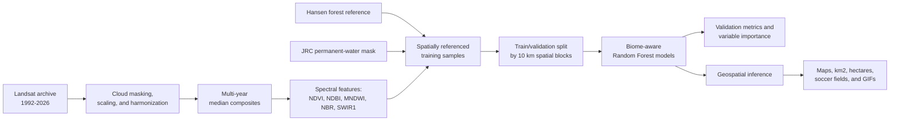

# Geospatial Vegetation Remote Sensing Analytics across Latin American Biomes and Cities

*Applied AI and Data Science project following vegetation change from 1992 to 2026*

> A satellite image captures a place for an instant. Thirty-four years of images can begin to tell its story.

This project started with a practical question: **can decades of satellite imagery be turned into evidence that people can understand, compare, and act on?**

Using the Landsat archive, the research follows vegetation from **1992 through the latest observations available in 2026**. It looks at two landscapes that are often discussed together but behave very differently: remote forest frontiers, where land conversion can remove large areas of tree cover, and capital-city regions, where parks, water, topography, agriculture, urban growth, and seasonal vegetation overlap within the same satellite view.

The work moves beyond simply looking at RGB images. It combines cloud-screened satellite composites, spectral feature engineering, ecological reference data, spatially validated **Random Forest models**, interpretable classification rules, and geospatial inference. The result is a set of maps, metrics, and time-lapse GIFs that make long-term environmental change easier to see without hiding the uncertainty behind it.

This is not an official forest inventory. It is an applied AI workflow for asking better questions of Earth observation data and translating the answers for technical, non-technical, and policy audiences.

## See the Change

These time-lapse GIFs are the fastest way into the project. They show the validated triennial comparison from 2012-2014 through 2024-2026, making it possible to scan more than a decade of modeled vegetation patterns in a few seconds. The full research archive extends back to 1992; this lightweight visual set focuses on the more comparable recent analytical window.

The combined view places the five vegetation fronts on the top row and their five capital-city regions directly below them, aligned by country.


The animated chart below follows the aggregate dense-vegetation area for the five capital AOIs and the selected fronts grouped into Southern Humid, Northern Humid, and Dry biome classes.



### Vegetation Fronts and Biomes

| Country | Biome / vegetation front | Timelapse |
| --- | --- | --- |
| Bolivia | Chiquitano dry vegetation |  |
| Colombia | Northwestern Amazon moist vegetation |  |
| Guatemala | Peten-Veracruz moist vegetation |  |
| Honduras | Central American Atlantic moist vegetation |  |
| Paraguay | Western Chaco dry vegetation |  |

### Capital Cities

| Country | Capital city | Timelapse |
| --- | --- | --- |
| Bolivia | La Paz |  |
| Colombia | Bogota |  |
| Guatemala | Guatemala City |  |
| Honduras | Tegucigalpa |  |
| Paraguay | Asuncion |  |

## At a Glance

| Dimension | Project scope |
| --- | --- |
| Historical record | 1992-2026, a 34-year Landsat observation span |
| Satellite missions | Landsat 5, 7, 8, and 9 |
| Spatial resolution | 30 m nominal Landsat pixels |
| Study unit | AOIs of approximately 1,000 km2 |
| Public comparison set | 5 forest/biome frontiers and 5 capital-city regions |
| Broader exploration | 13 Latin American and Caribbean capitals |
| Engineered features | NDVI, NDBI, MNDWI/NDWI, NBR, and SWIR1 |
| AI models | 3 ecology-aware Random Forest classifiers, 200 trees each |
| Reference data | Hansen Global Forest Change and JRC Global Surface Water |
| Validation strategy | Held-out 10 km spatial blocks |
| Outputs | Classified rasters, area statistics, model metrics, variable importance, and GIFs |

## From 1992 to the Present

The project has two connected time scales. Keeping them separate is important because the long historical view and the validated model comparison answer different questions.

### 1. The long historical view: 1992-2026

The Landsat record was organized into seven five-year epochs:

| Historical epoch | Purpose |
| --- | --- |
| 1992-1996 | Earliest reference view |
| 1997-2001 | End-of-century transition |
| 2002-2006 | Early modern comparison and model-training composite |
| 2007-2011 | Pre-2012 transition |
| 2012-2016 | Recent baseline context |
| 2017-2021 | Contemporary transition |
| 2022-2026 | Latest available conditions |

These epochs form the historical backbone of the research. They were used to inspect RGB change, test AOI design, compare sensor generations, and understand where apparent vegetation change might actually come from clouds, water, seasonality, or urban surfaces.

Landsat 5 and 7 observations are harmonized toward the Landsat 8 spectral response before comparison. Cloud, cloud-shadow, fill, and invalid reflectance pixels are masked, and multi-year median composites reduce the influence of any single noisy scene.

### 2. The comparable ML time series: 2012-2026

The final lightweight release focuses on shorter, consistent triennial windows:

| Model-comparison period | Interpretation |
| --- | --- |
| 2012-2014 | Baseline |
| 2015-2017 | Intermediate state |
| 2018-2020 | Intermediate state |
| 2021-2023 | Recent state |
| 2024-2026 | Latest available state |

Why narrow the final comparison? A longer archive is valuable for context, but a model needs inputs that are as comparable as possible. Triennial composites preserve enough imagery to reduce cloud and seasonal noise while still showing meaningful movement through time.

The **2024-2026** composite uses imagery available when the analysis was run. Because 2026 is still in progress, this latest interval is provisional and should be refreshed after the year is complete.

## The AI and Machine Learning Workflow

The core challenge is not drawing a green mask. It is teaching a system to distinguish probable tree cover from surfaces that can look spectrally similar, then checking whether that system still works in places it did not see during training.



### Learning from an early mistake

One of the most useful moments in the project came from a bad map. An early classifier marked parts of **Lake Ilopango** near San Salvador as forest. Visually, it was obviously wrong. Analytically, it exposed a deeper problem: no single vegetation threshold can reliably separate trees from water, shadows, wet soil, crops, and seasonal regrowth in every landscape.

That failure changed the design. The improved workflow combines five complementary spectral variables, explicitly removes persistent water, uses different forest-reference thresholds for dry and humid biomes, and validates models with spatially separate blocks. In other words, the AI pipeline became stronger because a human looked at the output and challenged what did not make sense.

### What the model sees

Each pixel is represented by five satellite-derived features:

| Feature | Environmental signal |
| --- | --- |
| NDVI | Vegetation greenness and photosynthetic vigor |
| NDBI | Built-up surfaces, exposed soil, and urban signal |
| MNDWI / NDWI | Open water and surface-water influence |
| NBR | Canopy condition, burn effects, and vegetation disturbance |
| SWIR1 | Moisture, dry soil, and forest/non-forest separation |

Together, these features provide more context than NDVI alone. The model can consider greenness alongside moisture, water, disturbance, and built-up signals before assigning a class.

### How the Random Forest models were trained

- A **2002-2006 Landsat composite** supplies the spectral training features.
- **Hansen Global Forest Change** `treecover2000` supplies the reference class.
- A 40% tree-cover threshold is used for dry-forest regions; 50% is used for humid-forest regions.
- Persistent water, defined from JRC Global Surface Water, is excluded before sampling and inference.
- Samples are balanced by class so abundant non-forest pixels do not dominate learning.
- Entire 10 km blocks, rather than individual random pixels, are held out for validation.
- Three Random Forest classifiers with **200 decision trees each** specialize in dry, northern humid, and southern humid forest contexts.

Spatial block validation matters here. Nearby pixels often resemble one another, so randomly splitting adjacent pixels can make a model appear more accurate than it really is. Holding out whole geographic blocks provides a more demanding and honest test.

### Validated model performance

| Model | Training regions | Hansen threshold | Overall accuracy | Kappa | Forest F1 |
| --- | --- | ---: | ---: | ---: | ---: |
| Dry forest | Bolivia + Paraguay | 40% | 0.9561 | 0.8836 | 0.9128 |
| Northern humid forest | Guatemala + Honduras + Nicaragua | 50% | 0.9263 | 0.8400 | 0.9425 |
| Southern humid forest | Colombia + Panama | 50% | 0.9557 | 0.6396 | 0.9763 |

The repository includes the validation metrics and feature-importance tables so that the model is not presented as a black box. High accuracy alone is not treated as proof; Kappa, precision, recall, F1, spatial behavior, and visual plausibility are considered together.

## Two Complementary Analytical Methods

The public outputs intentionally retain two methods:

- **Forest frontiers:** supervised Random Forest classification trained by ecological group.
- **Capital-city AOIs:** a strict, interpretable five-index dense-vegetation rule used for local urban and peri-urban comparison.

This distinction is deliberate. Dense urban vegetation is not the same thing as intact forest, and a city-centered AOI should not be used as a proxy for national deforestation. The project compares the two contexts without pretending they measure exactly the same ecological phenomenon.

## Geographic Focus

The broader research explored 13 capitals across Latin America and the Caribbean. After iterative tests, the lightweight public set was narrowed to five countries with paired forest-front and capital-region views:

| Country | Forest front / biome | Capital region |
| --- | --- | --- |
| Bolivia | Chiquitano dry forests | La Paz |
| Colombia | Northwestern Amazon moist forests | Bogota |
| Guatemala | Peten-Veracruz moist forests | Guatemala City |
| Honduras | Central American Atlantic moist forests | Tegucigalpa |
| Paraguay | Western Chaco dry forests | Asuncion |

Each AOI covers approximately **1,000 km2**. Frontier AOIs were placed where land-use pressure is environmentally meaningful; capital AOIs were centered on the urban region to capture the city and its peri-urban surroundings.

## What the Latest Comparison Shows

Across the five selected forest-front AOIs, the model indicates an approximate net reduction of:

> **635.13 km2 of probable forest cover**, equivalent to **63,513 hectares** or approximately **88,955 professional soccer fields**.

| Forest front | Comparison baseline | Baseline km2 | Latest km2 | Net reduction km2 |
| --- | --- | ---: | ---: | ---: |
| Bolivia | 2012-2014 | 313.56 | 171.84 | 141.72 |
| Colombia | 2012-2014 | 714.24 | 648.44 | 65.80 |
| Guatemala | 2012-2014 | 699.55 | 524.25 | 175.30 |
| Honduras | 2012-2014 | 995.61 | 837.31 | 158.30 |
| Paraguay | 2015-2017 | 283.03 | 189.02 | 94.01 |
| **Combined** | Mixed baseline |  |  | **635.13** |

For Paraguay's Chaco AOI, **2015-2017** is the preferred baseline because it produced a more internally consistent reference than 2012-2014 for that dry and highly seasonal landscape.

The capital results tell a different story. Four of the five selected urban/peri-urban AOIs show a positive dense-vegetation balance, while Guatemala City shows a reduction. These are local spectral vegetation signals, not evidence that the corresponding countries gained forest.

| Capital AOI | 2012-2014 km2 | 2024-2026 km2 | Net change km2 |
| --- | ---: | ---: | ---: |
| La Paz | 0.17 | 0.82 | +0.65 |
| Bogota | 325.06 | 381.96 | +56.90 |
| Guatemala City | 444.27 | 380.49 | -63.78 |
| Tegucigalpa | 421.14 | 434.43 | +13.29 |
| Asuncion | 320.83 | 359.59 | +38.77 |

The contrast is the point: **where an AOI is placed can change the environmental story**. A capital may gain parks, irrigated vegetation, secondary growth, or seasonal greenness while a distant agricultural frontier loses mature forest. AI can reveal the pattern, but geography gives it meaning.

## Repository Contents

This is a **lightweight release** containing the analytical code, final tables, and communication-ready visuals. Heavy raster and model artifacts remain local.

```text
.
|-- data/
|   |-- agregado_vegetacion_clases_trienios_2012.csv
|   |-- capitales_seleccionadas_trienios_2012_2026_1000km2.csv
|   |-- estadisticas_grupo_a_trienios_2012.csv
|   |-- metricas_modelos_grupo_a.csv
|   |-- importancia_variables_seco.csv
|   |-- importancia_variables_humedo_norte.csv
|   `-- importancia_variables_humedo_sur.csv
|-- gifs/
|   |-- capitales/
|   `-- frentes/
|-- scripts/
|   |-- gee_export_grupo_a.py
|   |-- rf_train_grupo_a.py
|   |-- inferencia_grupo_a.py
|   |-- analyze_capital_trienios_2012.py
|   |-- generate_capital_trienio_gifs.py
|   |-- generate_combined_vegetation_gif.py
|   `-- generate_aggregate_evolution_gif.py
`-- README.md
```

| Script | Role in the pipeline |
| --- | --- |
| `scripts/gee_export_grupo_a.py` | Builds AOIs, harmonizes Landsat sensors, derives indices, masks water, and exports composites |
| `scripts/rf_train_grupo_a.py` | Creates spatial blocks, trains the three Random Forest models, validates them, and exports feature importance |
| `scripts/inferencia_grupo_a.py` | Applies the trained models and converts classified pixels into area metrics and maps |
| `scripts/analyze_capital_trienios_2012.py` | Calculates strict dense-vegetation indicators for the selected capitals |
| `scripts/generate_capital_trienio_gifs.py` | Turns the capital time series into communication-ready GIFs |
| `scripts/generate_combined_vegetation_gif.py` | Aligns the five vegetation fronts and five capitals in one synchronized GIF |
| `scripts/generate_aggregate_evolution_gif.py` | Aggregates the four analytical classes and renders their animated chart |

The repository excludes raw GeoTIFFs, Google Earth Engine credentials, virtual environments, large intermediate rasters, and serialized model binaries. Reproducing the full workflow requires Earth Engine access and regeneration of those local artifacts.

## Reading the Results Responsibly

The outputs are decision-support signals, not ground truth. Important limitations include:

- Landsat's 30 m resolution cannot resolve individual trees or narrow vegetation corridors reliably.
- Cloud, shadow, seasonal moisture, crop cycles, smoke, and sensor availability can affect a composite.
- The 2024-2026 period is incomplete while 2026 is still underway.
- Valid-pixel coverage can vary across wet tropical AOIs, especially in cloudy periods.
- Hansen tree-cover labels provide a consistent training reference, but they do not replace contemporary field observations.
- A pixel classified as probable forest is a spectral and statistical prediction, not a botanical inventory.
- Urban dense vegetation may include parks, crops, gardens, secondary growth, or peri-urban woodland.
- The reported areas describe the selected 1,000 km2 AOIs and must not be extrapolated into national totals.

The most credible use of these outputs is comparative: identify where change appears persistent, inspect the map, compare periods, consult model diagnostics, and then combine the signal with local knowledge or field evidence.

## Why This Project Matters

Environmental change is often presented either as a technical raster that few people can interpret or as a headline with no visible analytical trail. This project tries to connect those worlds.

It demonstrates how applied AI can help a researcher move from millions of satellite pixels to a question a community, analyst, or policymaker can discuss: **what changed here, how large was the change, and how confident should we be?** The maps make the pattern visible, the area conversions make its scale tangible, and the validation tables keep the model accountable.

The broader ambition is to make geospatial AI useful for Latin America: grounded in the region's landscapes, transparent about uncertainty, and understandable beyond a machine-learning notebook.

## Acknowledgement

This work was made possible through access to Google Earth Engine under a **Google Earth Engine non-profit license** granted for this project. I am deeply grateful for that access. It made it possible to work with decades of satellite observations at a scale that would otherwise be difficult for an independent applied research project, while keeping the analysis focused on environmental monitoring and public-interest learning.

Google Earth Engine provided the computational gateway to the satellite archive. The interpretation, model design, local processing, quality checks, and communication products in this repository were developed as part of this independent project.
